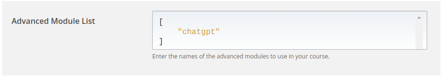

# ChatGPT for Open edX

This repository contains an Open edX XBlock that brings the power of OpenAI's ChatGPT to your Open edX course.

<video width="320" height="240" controls>
  <source src="./screenshots/Screencast.webm" type="video/webm">
</video>

## Features

- Engaging, dynamic chat interface powered by ChatGPT.
- Customizable prompts and settings to tailor the AI's responses.
- Works seamlessly with the edX ecosystem.

## Installation

This method works with [tutor](https://github.com/overhangio/tutor). feel free to add a method that works with devstack.

First, go to your requirements directory:

```sh
cd $(tutor config printroot)/env/build/openedx/requirements/
```

update the `private.txt` (if you don't have that, create one) and add the `chatgpt-xblock` repo to it:

```sh
echo "git+https://github.com/CodeWithEmad/chatgpt-xblock.git" >> private.txt
```

and build a new image:

```sh
tutor images build openedx
```

in your studio, in your desired course, go to Advanced Settings and add `"chatgpt"` in the Advanced Module List.




## Development

There's no need to build a new image, if you just want to play with the xblock.

First, clone the repo in the requirements directory:

```sh
cd $(tutor config printroot)/env/build/openedx/requirements/
git clone git@github.com:CodeWithEmad/chatgpt-xblock.git
```

exec to the cms container and install the XBlock:

```sh
tutor dev exec -it cms bash
cd ../requirements
pip install -e chatgpt-xblock
```

Note: This is not the best practice to develop an XBlock, but it works if you don't want to build dev image.

## License

This work is licensed under the terms of the [GNU Affero General Public License (AGPL)](https://github.com/overhangio/tutor/blob/master/LICENSE.txt).
